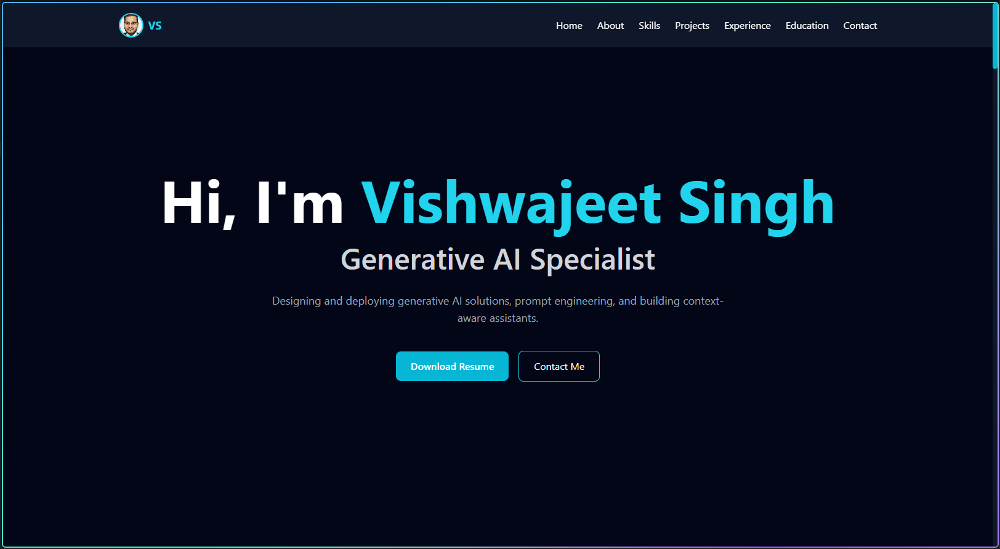

# Vishwajeet Singh - Portfolio

An **enterprise-grade, modular portfolio website** built with React, Vite, and Tailwind CSS. Showcases professional portfolio sections with optimized performance, clean architecture, and best practices for scalability.

## 🎯 Project Philosophy

This portfolio follows **enterprise software engineering principles**:
- **Modular Architecture** - Each section is a separate, self-contained component
- **Centralized Configuration** - Single source of truth for data and design tokens
- **Reusable Logic** - Custom hooks for common patterns
- **Separation of Concerns** - Clear boundaries between UI, logic, data, and styles
- **Production Ready** - Optimized build, linting, and code quality checks
- **Maintainability** - Easy to update, extend, and debug

## 🚀 Live Demo

View the deployed portfolio here:

[https://vishwajeet-portfolio-sigma.vercel.app/](https://vishwajeet-portfolio-sigma.vercel.app/)



## 🚀 Quick Start

### Prerequisites
- **Node.js** (v16 or higher)
- **npm** (comes with Node.js)

### Installation

1. **Navigate to the project directory**
   ```bash
   cd vishwajeet_portfolio
   ```

2. **Install dependencies**
   ```bash
   npm install
   ```

## 📋 Available Scripts

### Development Mode
Start the development server with hot module reloading (HMR):
```bash
npm run dev
```
Then open `http://localhost:5173` in your browser.

### Build for Production
Create an optimized production build:
```bash
npm run build
```
Output files will be in the `dist/` folder.

### Preview Production Build
Test the production build locally:
```bash
npm run preview
```

### Lint Code
Check code quality with ESLint:
```bash
npm run lint
```

### Deploy to Vercel
If your project is connected to Vercel, push to the linked GitHub branch and Vercel will redeploy automatically.

If you want to deploy from local machine:
```bash
npm i -g vercel
vercel --prod
```

## 🛠️ Tech Stack

| Technology | Purpose | Version |
|-----------|---------|---------|
| **React** | UI Library | 19.2.5 |
| **Vite** | Build Tool & Dev Server | 8.0.10 |
| **Tailwind CSS** | Utility-First Styling | 3.4.1 |
| **PostCSS** | CSS Processing | Latest |
| **Autoprefixer** | Browser Compatibility | Latest |
| **ESLint** | Code Quality | 10.2.1 |
| **React Hooks ESLint** | Hook Validation | Latest |

## 📁 Enterprise Project Structure

```
src/
├── components/                    # UI Components (8 portfolio sections)
│   ├── Navbar.jsx                # Navigation bar
│   ├── Home.jsx                  # Hero section with typing animation
│   ├── About.jsx                 # About & expertise overview
│   ├── Skills.jsx                # Technical skills with proficiency
│   ├── Projects.jsx              # Featured projects showcase
│   ├── Experience.jsx            # Work experience timeline
│   ├── Education.jsx             # Educational roadmap section
│   ├── Contact.jsx               # Contact information & links
│   └── Footer.jsx                # Page footer
│
├── hooks/                        # Custom React Hooks
│   └── useIntersectionObserver.js # Scroll-triggered visibility state
│
├── constants/                    # Centralized Data & Configuration
│   ├── portfolio.js              # All portfolio content and navigation links
│   └── theme.js                  # Design Tokens & Theme Configuration
│
├── styles/                       # Global Stylesheets
│   └── globals.css               # Base styles, scrollbar, focus states
│
├── App.jsx                       # Root component (22 lines)
├── main.jsx                      # React entry point
└── index.css                     # Tailwind imports + global styles
```

## ✨ Enterprise Features Implemented

### 🏗️ Architecture
- ✅ **Modular Components** - 8 self-contained UI components
- ✅ **Custom Hooks** - Reusable logic with `useIntersectionObserver`
- ✅ **Centralized Configuration** - Single source of truth for data
- ✅ **Theme System** - Design tokens for colors, spacing, animations
- ✅ **Utility Functions** - Helper functions for common tasks
- ✅ **Clean Entry Point** - App.jsx is only 22 lines

### 🎨 Styling & Design
- ✅ **Tailwind CSS** - Utility-first, no component CSS files needed
- ✅ **Design Tokens** - Consistent colors, spacing, shadows, transitions
- ✅ **Global Styles** - Base styles, scrollbar customization, focus states
- ✅ **Responsive Design** - Mobile-first with md/lg/xl breakpoints
- ✅ **Dark Theme** - Professional slate color scheme with cyan & violet accents

### ✨ User Experience
- ✅ **Typing Animation** - Animated role rotation in hero section
- ✅ **Scroll Animations** - Intersection Observer for fade-in effects
- ✅ **Smooth Navigation** - Fixed navbar with anchor links
- ✅ **Hover Effects** - Interactive buttons and cards
- ✅ **Gradient Effects** - Modern gradient borders and text

### 🔧 Developer Experience
- ✅ **Hot Module Reloading** - Instant updates during development
- ✅ **ESLint Validation** - Enforces code quality & React best practices
- ✅ **Production Optimization** - Build output: 214KB gzipped
- ✅ **Documentation** - JSDoc comments on all functions
- ✅ **Easy Data Updates** - Modify content in `constants/portfolio.js`

### 📊 Data Management
- ✅ **Centralized Constants** - All portfolio data in `constants/portfolio.js`
- ✅ **Easy Updates** - Change skills, projects, experience in one place
- ✅ **Dynamic Rendering** - Components loop through data automatically
- ✅ **Type-Friendly** - Well-structured data objects

### ⚡ Performance
- ✅ **Lazy Loading** - Intersection Observer prevents unnecessary animations
- ✅ **Optimized Build** - Vite produces minimal bundle size
- ✅ **Tree Shaking** - Unused code removed automatically
- ✅ **Gzip Compression** - 3.9 KB CSS, 65.7 KB JS (gzipped)

## 📖 Key Concepts

### Custom Hooks
**`useIntersectionObserver`** - Triggers animations when elements enter viewport
```javascript
const { ref, isVisible } = useIntersectionObserver();
// Use ref on DOM element, isVisible for conditional rendering
```

### Design Tokens
Centralized theme configuration for consistency:
```javascript
import { THEME, ANIMATION } from '../constants/theme.js';
// Colors, spacing, shadows, animation timings all defined once
```

### Centralized Data
All portfolio content in one file for easy maintenance:
```javascript
import { PROFILE, PROJECTS, EXPERIENCES } from '../constants/portfolio.js';
// Add projects, skills, experience - components update automatically
```

### Utility Functions
Helper functions for common patterns:
```javascript
import { cn } from '../utils/classNames.js';
import { typeText, deleteText, delay } from '../utils/animations.js';
```

## 🔍 Code Quality

- **ESLint** - Zero errors, best practices enforced
- **React Hooks Validation** - Proper dependency arrays
- **Clean Code** - Well-documented functions with JSDoc
- **Production Ready** - Passes linting, builds without warnings

## 📊 Build Output

```
✓ 27 modules transformed
✓ dist/index.html         0.47 kB │ gzip: 0.30 kB
✓ dist/assets/index.css  15.68 kB │ gzip: 3.90 kB
✓ dist/assets/index.js  214.68 kB │ gzip: 65.68 kB
✓ Built in 527ms
```

## 🎓 How to Use

### Update Profile Information
Edit `src/constants/portfolio.js`:
```javascript
export const PROFILE = {
  name: 'Your Name',
  title: 'Your Title',
  email: 'your.email@example.com',
  bio: 'Your bio...',
  // ...
};
```

### Add New Projects
Add to `PROJECTS` array in `src/constants/portfolio.js`:
```javascript
{
  id: 'G',
  title: 'Project Name',
  description: 'Project description...',
  tags: ['Tech1', 'Tech2'],
  github: 'https://github.com/...',
}
```

### Modify Design
Edit `src/constants/theme.js`:
```javascript
colors: {
  primary: '#06b6d4',      // cyan
  secondary: '#a855f7',    // violet
  // ...
}
```

### Add New Component
1. Create `src/components/YourComponent.jsx`
2. Import in `App.jsx`
3. Add to component layout
4. Use data from `constants/portfolio.js`

## 📤 Deployment

The build output in the `dist/` folder is ready to deploy to:
- **Vercel** (Recommended)
- **Netlify**
- **GitHub Pages**
- **AWS S3 + CloudFront**
- **Any static hosting**

### Deploy to Vercel
```bash
npm install -g vercel
vercel
```

## 🌟 Best Practices Demonstrated

This project exemplifies enterprise-level React development:
- Component-based architecture
- Separation of concerns (UI, logic, data, styles)
- Reusable custom hooks
- Centralized configuration management
- Clean, maintainable code
- Production-optimized builds
- Accessibility considerations
- Responsive design patterns
- Performance optimization
- Documentation and comments

## 📄 License

This project is open source and available under the MIT License.

## 👤 Author

**Vishwajeet Singh**
- Email: vishwajeetsinghlife@gmail.com
- GitHub: [vishwajeetsingh01](https://github.com/vishwajeetsingh01)
- LinkedIn: [vishwajeetsingh-](https://linkedin.com/in/vishwajeetsingh-)

---

**Last Updated**: 2026 | Built with React 19, Vite 8, and Tailwind CSS 3
